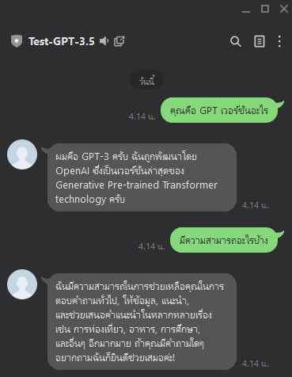

# 🤖 Building LINE Chatbot with Azure OpenAI Service

This project demonstrates how to build a LINE Messaging chatbot powered by Azure OpenAI Service using GPT models. The chatbot can respond intelligently to user messages with natural language generation.

##  Features

- LINE Messaging API integration
- Azure OpenAI (GPT-3.5) backend
- Deployable on cloud
- Environment-based configuration

##  Tech Stack

- LINE Messaging API
- Azure OpenAI Service (via REST API)
- Python 3.12 / FastAPI
- Ngrok (for local testing)

